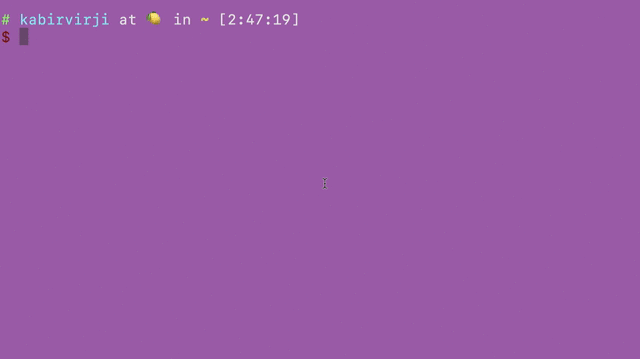
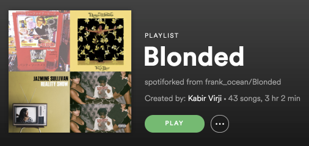

# spotifork 🍴

> Fork a Spotify playlist


<!-- need new gif with name parameter -->

## Install
`$ npm install -g spotifork` <br><br>
**Note:** Node version 7.7.1+ required. `$ node -v` to check which version you have installed. The latest version can be downloaded [here](https://nodejs.org/en/)

## Usage
`$ spotifork <playlist URI>`

The program will then prompt you for your Spotify username and bearer token. <br>

You can get the playlist URI by going to **share** on whichever Spotify platform you're on. <br>

You can get the bearer token here: https://developer.spotify.com/web-api/console/post-playlists/ <br>
Click **GET OAUTH TOKEN** and make sure to check *playlist-modify-public* 

## Optional Parameters

`-n` to specify the new forked playlist name

<br>

`$ spotifork --help`

```
Usage
      $ singlespotify "<playlist URI>"
      ? Enter your Spotify username <username>
      ? Enter your Spotify bearer token <bearer>

    Options
      --name [-n] "playlist name"

    Example
      $ spotifork spotify:user:kabirvirji:playlist:57wpYVzySANpWQpiBetoMi -n "My awesome playlist!"
      ? Enter your Spotify username kabirvirji
      ? Enter your Spotify bearer token ************************************************************

    For more information visit https://github.com/kabirvirji/spotifork
```

